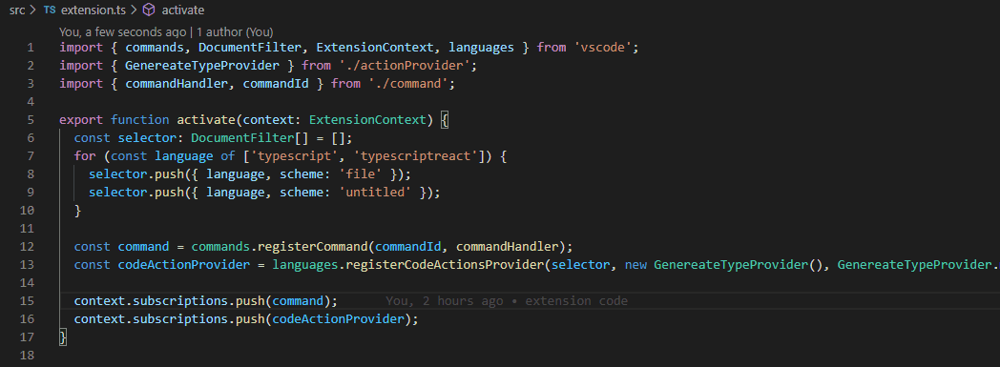

# TypeScript Explicit Types

VS Code extensions that lets you generate explicit typescript types for you properties and variables

## Demo

## Prequisites

This extension requires VS Code TypeScript support to be turned on
